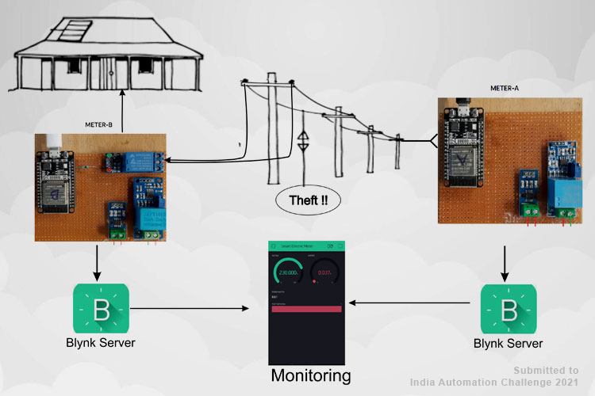
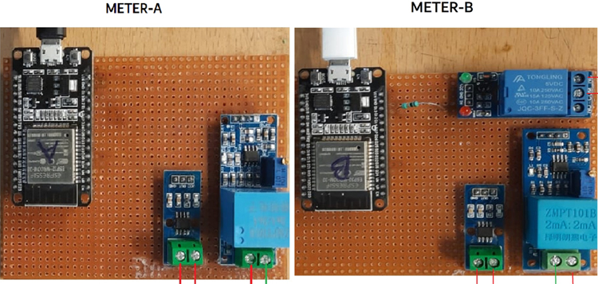
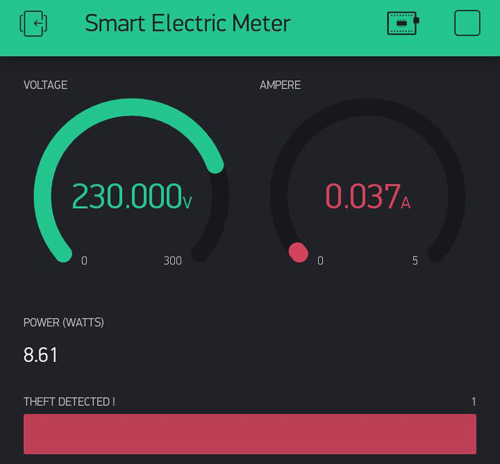
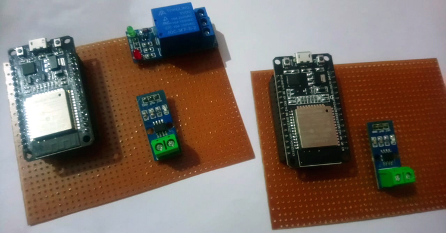
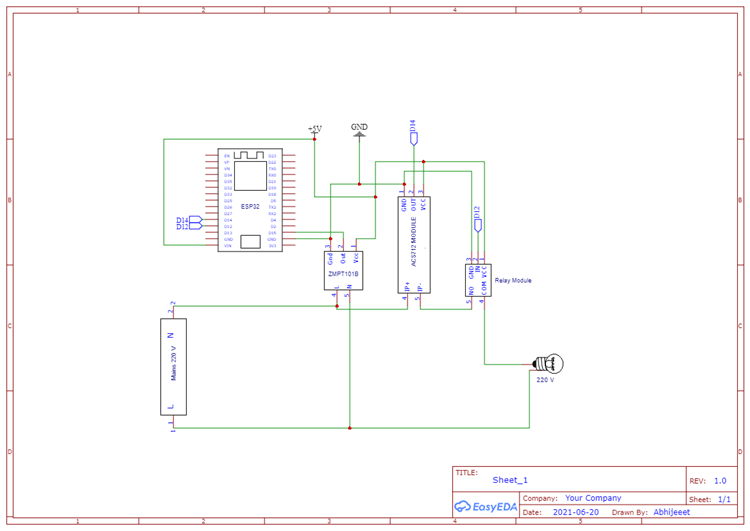
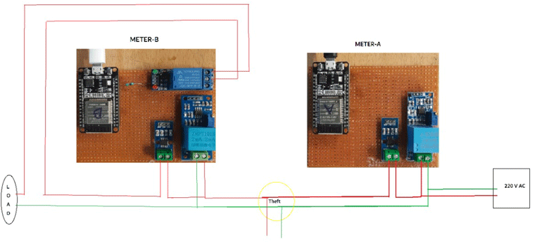

# Smart Electricity Meter with Energy Monitoring and Feedback System for Theft Detection

  

### Description:

The project is basically to detect the electricity theft from the electricity meters used in households as well as in the commercial sector. There are two energy monitoring meters were used in this system, one for the distribution line and another one for the consumer side. The system consists of a master meter and one or multiple slave meters connected together with the help of a network. Whenever the distribution line load reading does not matches the consumer side readings; that means there is some kind of power leakage in between distribution and consumer line, leads to differences in energy readings, and theft will be detected. When the theft will occur, a notification will be sent to the app and consumer side power will be cut off. The data send to the Blynk Application Dashboard and display's the Voltage, Current, Power & total unit consumed in kWh with theft detection alert. 
 
  

**Blynk App**

### Project Used Hardware
ESP32, ACS712 current sensor module, ZMPT101B voltage sensor module, Relay module, Connection Wires. 

### Project Used Software
Arduino, Blynk IoT platform

### Project Hardware Software Selection
I need to select the current sensor as well as the voltage sensor so that the current & voltage can be measured and thus I can know about the power consumption & total power consumed for theft detection with the help of ESP32 and IoT Blynk platform.

**ESP32**: ESP32 microcontroller module offers a built-in Wi-Fi feature which is ideal for IoT projects since the project is based on the same.

**ZMPT101B**: ZMPT101B is a high-precision voltage Transformer I use to measure the accurate AC voltage.

**ACS712**: ACS712 is a fully integrated, hall effect-based linear current sensor use to measure the alternating current in this project.

**Relay Module**: The relay module is used as a switch for the mains power line. It is controlled by ESP32, when theft is detected, the relay activates and cuts the mains power. 

### Circuit Diagram
 

 

Consumer side meter Schematics same for the Distribution side except for Relay (only use on the consumer side). Current Sensor & ZMPT101B Voltage Sensor VCC is connected to Vin of ESP32 which is a 5V Supply. The GND pin of both the modules is connected to the GND of ESP32. The output analog pin of the ZMPT101B Voltage Sensor and Current Sensor is connected to ESP32. The voltage sensor is connected in parallel with mains and the Current Sensor in series, also the relay as a switch for the output. 
## References
* **[Solarduino](https://solarduino.com/how-to-combine-values-from-different-nodemcu-using-blynk-app-for-online-monitoring/)**
* **[Blynk docs](http://docs.blynk.cc/#widgets-other-bridge)**

## License

Copyright © 2022 Abhijeet kumar. All rights reserved.

Licensed under the [MIT License](LICENSE). 
#
All projects in india automation challenge [project-listing](docs/project-listing.pdf) 
E-meter [pitch ](docs/challenge-pitch.pdf)
